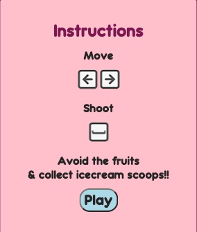

# SCOOP IT!

## Description 

Scoop it! is an arcade game built with web technologies (HTML, CSS and JavaScript) where you control an ice cream cone to collect delicious ice cream scoops while avoiding fruits. The game offers straigthforward mechanics and a clear objective.

Objective: collect as many ice cream scoops as you can and aim for the highest score.

## How to play

Left Arrow: Move the ice cream cone to the left.
Right Arrow: Move the ice cream cone to the right.
Spacebar: Shoot a snowflake to convert a fruit into a scoop.

## Demo
To test the game online, access this link:
[Online Demo](https://juliasendra.github.io/scoopit-game/).

Have fun and enjoy Scoop It!

